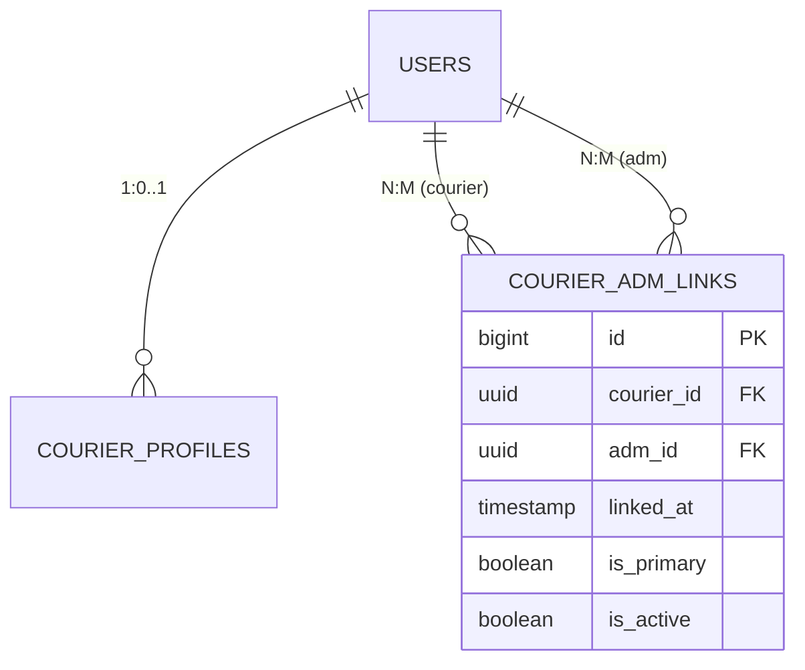

# Atualização: Relacionamento Courier ↔ ADM (N:1 → N:M)

**Data:** 18 de outubro de 2025  
**Status:** ✅ Documentação Atualizada  
**Versão:** 1.0

---

## 📋 Resumo da Mudança

### Situação Anterior (N:1)
- Cada motoboy (Courier) tinha **apenas 1 gerente (ADM)**
- Relacionamento direto via `adm_id` em `courier_profiles`
- Limitação: Courier não podia trabalhar para múltiplos gerentes/regiões

### Situação Nova (N:M)
- Cada motoboy pode trabalhar com **múltiplos gerentes**
- Relacionamento via tabela intermediária `courier_adm_links`
- Flexibilidade: Courier pode atuar em diferentes regiões/organizações
- **ADM Principal**: Flag `is_primary` identifica o gerente responsável principal

---

## 🎯 Motivação

### Necessidade de Negócio
1. **Flexibilidade Operacional**: Motoboys podem trabalhar em múltiplas regiões
2. **Múltiplas Organizações**: Courier pode ter diferentes gerentes por área
3. **Escalabilidade**: Facilita expansão geográfica do serviço
4. **Gerenciamento Distribuído**: ADMs podem compartilhar couriers

### Exemplo de Uso Real
```
Motoboy João trabalha:
- Com ADM Maria (região Centro) → is_primary = true
- Com ADM Pedro (região Norte) → is_primary = false
- Com ADM Ana (região Sul) → is_primary = false
```

---

## 🗄️ Alterações no Banco de Dados

### Nova Tabela: `courier_adm_links`

```sql
CREATE TABLE courier_adm_links (
    id BIGSERIAL PRIMARY KEY,
    courier_id UUID NOT NULL REFERENCES users(id) ON DELETE CASCADE,
    adm_id UUID NOT NULL REFERENCES users(id) ON DELETE CASCADE,
    linked_at TIMESTAMP NOT NULL DEFAULT CURRENT_TIMESTAMP,
    is_primary BOOLEAN NOT NULL DEFAULT false,
    is_active BOOLEAN NOT NULL DEFAULT true,
    
    UNIQUE (courier_id, adm_id)
);

-- Apenas um ADM principal por courier ativo
CREATE UNIQUE INDEX idx_courier_primary_adm 
ON courier_adm_links(courier_id) 
WHERE is_primary = true AND is_active = true;

-- Índices para queries
CREATE INDEX idx_courier_link_courier ON courier_adm_links(courier_id);
CREATE INDEX idx_courier_link_adm ON courier_adm_links(adm_id);
CREATE INDEX idx_courier_link_primary ON courier_adm_links(is_primary);
CREATE INDEX idx_courier_link_active ON courier_adm_links(is_active);
```

### Remoção de Campo

**Tabela:** `courier_profiles`  
**Campo removido:** `adm_id UUID`  
**Motivo:** Substituído pela tabela `courier_adm_links`

---

## 📐 Modelo de Dados (MER)

### Relacionamentos Atualizados



### Cardinalidades

| Relacionamento              | Cardinalidade | Descrição                           |
| --------------------------- | ------------- | ----------------------------------- |
| User (courier) ↔ User (adm) | N:M           | Courier trabalha com múltiplos ADMs |
| Courier → ADM (principal)   | N:1           | Courier tem 1 ADM principal         |

---

## 💻 Entidade Java (JPA)

### CourierADMLink.java (Nova)

```java
@Entity
@Table(name = "courier_adm_links")
public class CourierADMLink {
    
    @Id
    @GeneratedValue(strategy = GenerationType.IDENTITY)
    private Long id;
    
    @ManyToOne
    @JoinColumn(name = "courier_id", nullable = false)
    private User courier;
    
    @ManyToOne
    @JoinColumn(name = "adm_id", nullable = false)
    private User adm;
    
    @Column(name = "linked_at", nullable = false)
    private LocalDateTime linkedAt = LocalDateTime.now();
    
    @Column(name = "is_primary", nullable = false)
    private Boolean isPrimary = false;
    
    @Column(name = "is_active", nullable = false)
    private Boolean isActive = true;
    
    // Getters, setters, constructors...
}
```

### CourierProfile.java (Atualizado)

```java
@Entity
@Table(name = "courier_profiles")
public class CourierProfile {
    
    @Id
    @GeneratedValue(strategy = GenerationType.IDENTITY)
    private Long id;
    
    @OneToOne
    @JoinColumn(name = "user_id", nullable = false, unique = true)
    private User user;
    
    // REMOVIDO: 
    // @ManyToOne
    // @JoinColumn(name = "adm_id")
    // private User adm;
    
    // ... outros campos ...
    
    // NOVO: Relacionamento N:M via CourierADMLink
    @OneToMany(mappedBy = "courier")
    private Set<CourierADMLink> admLinks = new HashSet<>();
    
    // Helper methods
    public User getPrimaryADM() {
        return admLinks.stream()
            .filter(link -> link.getIsPrimary() && link.getIsActive())
            .map(CourierADMLink::getAdm)
            .findFirst()
            .orElse(null);
    }
    
    public Set<User> getAllActiveADMs() {
        return admLinks.stream()
            .filter(CourierADMLink::getIsActive)
            .map(CourierADMLink::getAdm)
            .collect(Collectors.toSet());
    }
}
```

---

## 🔄 Migrações Flyway

### V30__create_courier_adm_links.sql

```sql
-- Criar tabela N:M entre Courier e ADM
CREATE TABLE courier_adm_links (
    id BIGSERIAL PRIMARY KEY,
    courier_id UUID NOT NULL,
    adm_id UUID NOT NULL,
    linked_at TIMESTAMP NOT NULL DEFAULT CURRENT_TIMESTAMP,
    is_primary BOOLEAN NOT NULL DEFAULT false,
    is_active BOOLEAN NOT NULL DEFAULT true,
    
    CONSTRAINT fk_courier_adm_link_courier 
        FOREIGN KEY (courier_id) REFERENCES users(id) ON DELETE CASCADE,
    CONSTRAINT fk_courier_adm_link_adm 
        FOREIGN KEY (adm_id) REFERENCES users(id) ON DELETE CASCADE,
    
    CONSTRAINT uq_courier_adm_link UNIQUE (courier_id, adm_id)
);

-- Apenas um ADM principal por courier ativo
CREATE UNIQUE INDEX idx_courier_primary_adm 
ON courier_adm_links(courier_id) 
WHERE is_primary = true AND is_active = true;

-- Índices para performance
CREATE INDEX idx_courier_link_courier ON courier_adm_links(courier_id);
CREATE INDEX idx_courier_link_adm ON courier_adm_links(adm_id);
CREATE INDEX idx_courier_link_primary ON courier_adm_links(is_primary) WHERE is_primary = true;
CREATE INDEX idx_courier_link_active ON courier_adm_links(is_active);

-- Migrar dados existentes (se houver)
INSERT INTO courier_adm_links (courier_id, adm_id, is_primary, is_active, linked_at)
SELECT 
    user_id as courier_id,
    adm_id,
    true as is_primary,
    true as is_active,
    created_at as linked_at
FROM courier_profiles
WHERE adm_id IS NOT NULL;

-- Comentários para documentação
COMMENT ON TABLE courier_adm_links IS 'Relacionamento N:M entre Couriers e ADMs';
COMMENT ON COLUMN courier_adm_links.is_primary IS 'ADM principal responsável pelo courier';
COMMENT ON COLUMN courier_adm_links.is_active IS 'Link ativo (courier pode desativar associação)';
```

### V31__remove_adm_id_from_courier_profiles.sql

```sql
-- Remover coluna adm_id de courier_profiles (agora é N:M)
ALTER TABLE courier_profiles DROP COLUMN IF EXISTS adm_id;

-- Remover índice antigo
DROP INDEX IF EXISTS idx_courier_adm;

-- Comentário atualizado
COMMENT ON TABLE courier_profiles IS 'Perfil especializado para usuários COURIER. Relacionamento com ADMs via courier_adm_links (N:M).';
```

---

## 📊 Impacto no Sistema

### Queries Afetadas

#### ❌ Antes (N:1)
```java
// Buscar ADM do courier
User adm = courierProfile.getAdm();

// Query SQL antiga
SELECT * FROM courier_profiles WHERE adm_id = ?
```

#### ✅ Depois (N:M)
```java
// Buscar ADM principal do courier
User primaryAdm = courierProfile.getPrimaryADM();

// Buscar todos os ADMs ativos
Set<User> allAdms = courierProfile.getAllActiveADMs();

// Query SQL nova
SELECT u.* FROM users u
JOIN courier_adm_links cal ON u.id = cal.adm_id
WHERE cal.courier_id = ? 
  AND cal.is_primary = true 
  AND cal.is_active = true;
```

### Tabela `deliveries` (Denormalização)

**Campo mantido:** `adm_id` em `deliveries`  
**Propósito:** Performance - armazena o ADM principal no momento da atribuição  
**Fonte autoritativa:** `courier_adm_links.is_primary`

```sql
-- Ao atribuir entrega, denormalizar ADM principal
UPDATE deliveries 
SET 
    courier_id = ?,
    adm_id = (
        SELECT adm_id 
        FROM courier_adm_links 
        WHERE courier_id = ? 
          AND is_primary = true 
          AND is_active = true
    )
WHERE id = ?;
```

---

## ✅ Checklist de Implementação

### Fase 1: Preparação
- [x] Atualizar `ZAPI10_MER.md` com nova entidade
- [x] Atualizar `ZAPI10_MIGRATION_PLAN.md` com CourierADMLink
- [x] Remover referências antigas a `adm_id` em `CourierProfile`
- [x] Adicionar relacionamento N:M no diagrama MER
- [x] Atualizar tabela de cardinalidades
- [x] Adicionar constraints para CourierADMLink
- [x] Adicionar índices recomendados
- [x] Documentar este resumo

### Fase 2: Implementação (Pendente)
- [ ] Criar entidade `CourierADMLink.java`
- [ ] Atualizar entidade `CourierProfile.java` (remover `adm_id`, adicionar `admLinks`)
- [ ] Criar migração `V30__create_courier_adm_links.sql`
- [ ] Criar migração `V31__remove_adm_id_from_courier_profiles.sql`
- [ ] Atualizar queries que usavam `courierProfile.getAdm()`
- [ ] Criar endpoints REST para gerenciar vínculos Courier ↔ ADM
- [ ] Atualizar serviços de atribuição de entregas
- [ ] Testes unitários e integração

---

## 🧪 Casos de Teste

### 1. Criar Vínculo Courier ↔ ADM
```java
@Test
void shouldCreateCourierADMLink() {
    // Arrange
    User courier = createCourier();
    User adm = createADM();
    
    // Act
    CourierADMLink link = courierADMService.linkCourierToADM(
        courier.getId(), 
        adm.getId(), 
        true  // is_primary
    );
    
    // Assert
    assertNotNull(link.getId());
    assertTrue(link.getIsPrimary());
    assertTrue(link.getIsActive());
}
```

### 2. Garantir Apenas 1 ADM Principal Ativo
```java
@Test
void shouldEnforceOnePrimaryADMPerCourier() {
    // Arrange
    User courier = createCourier();
    User adm1 = createADM();
    User adm2 = createADM();
    
    // Act
    courierADMService.linkCourierToADM(courier.getId(), adm1.getId(), true);
    
    // Assert - deve lançar exceção ou setar adm1.is_primary = false
    assertThrows(DataIntegrityViolationException.class, () -> {
        courierADMService.linkCourierToADM(courier.getId(), adm2.getId(), true);
    });
}
```

### 3. Buscar Couriers por ADM
```java
@Test
void shouldFindCouriersByADM() {
    // Arrange
    User adm = createADM();
    User courier1 = createCourier();
    User courier2 = createCourier();
    
    courierADMService.linkCourierToADM(courier1.getId(), adm.getId(), true);
    courierADMService.linkCourierToADM(courier2.getId(), adm.getId(), false);
    
    // Act
    Set<User> couriers = courierADMService.findCouriersByADM(adm.getId());
    
    // Assert
    assertEquals(2, couriers.size());
}
```

---

## 📚 Documentos Relacionados

- [Plano de Migração Completo](./ZAPI10_MIGRATION_PLAN.md)
- [MER Atualizado](./ZAPI10_MER.md)
- [Documento Base Zapi10](./Zapi10_Documento_Base_Completo.md)

---

## 🎯 Próximos Passos

1. **Revisão**: Validar documentação com stakeholders
2. **Implementação**: Criar código Java e migrações SQL
3. **Testes**: Implementar casos de teste automatizados
4. **Deploy**: Aplicar em ambiente de desenvolvimento
5. **Validação**: Testar cenários de uso real
6. **Produção**: Deploy gradual com rollback plan

---

**✅ Status Final:** Documentação 100% atualizada  
**🚀 Pronto para:** Implementação de código

