# 🗺️ Zapi10 - Modelo Entidade-Relacionamento (MER)

**Data:** 18 de outubro de 2025  
**Projeto:** Zapi10 - Plataforma de Entregas  
**Base:** Migração do MVT Events

---

## 📊 Diagrama ER Completo

```mermaid
erDiagram
    %% ============================================================================
    %% CAMADA DE USUÁRIOS
    %% ============================================================================

    USERS ||--o{ COURIER_PROFILES : "1:1 (se role=COURIER)"
    USERS ||--o{ ADM_PROFILES : "1:1 (se role=ADM)"
    USERS ||--o{ DELIVERIES_AS_CLIENT : "1:N (como cliente)"
    USERS ||--o{ DELIVERIES_AS_COURIER : "1:N (como motoboy)"
    USERS ||--o{ DELIVERIES_AS_ADM : "1:N (como gerente)"

    USERS {
        uuid id PK
        varchar username "email único"
        varchar password "hash"
        enum role "CLIENT|COURIER|ADM|ADMIN"
        varchar name
        varchar cpf "único"
        varchar phone
        date date_of_birth
        enum gender "MALE|FEMALE|OTHER"
        varchar city
        varchar state
        varchar country
        text address
        varchar emergency_contact
        boolean active "default true"
        varchar tax_id "para formalização"
        timestamp created_at
        timestamp updated_at
    }

    COURIER_PROFILES {
        bigint id PK
        uuid user_id FK "único"
        varchar vehicle_plate
        varchar vehicle_model
        varchar license_number
        varchar cnh_category
        boolean has_insurance
        varchar insurance_number
        decimal rating "0-5"
        integer total_deliveries
        enum status "AVAILABLE|ON_DELIVERY|OFFLINE|SUSPENDED"
        timestamp created_at
        timestamp updated_at
    }

    ADM_PROFILES {
        bigint id PK
        uuid user_id FK "único"
        varchar region "região de atuação"
        decimal commission_percentage "default 5.00"
        integer total_couriers_managed
        integer total_deliveries_managed
        bigint partnership_id FK "parceria municipal"
        enum status "ACTIVE|INACTIVE|SUSPENDED"
        timestamp created_at
        timestamp updated_at
    }

    %% ============================================================================
    %% CAMADA OPERACIONAL
    %% ============================================================================

    DELIVERIES ||--|| PAYMENTS : "1:1"
    DELIVERIES ||--o| EVALUATIONS : "1:0..1"
    USERS ||--o{ EVALUATIONS_AS_EVALUATOR : "1:N"
    USERS ||--o{ EVALUATIONS_AS_EVALUATED : "1:N"

    DELIVERIES {
        bigint id PK
        uuid client_id FK "quem pediu"
        uuid courier_id FK "quem entrega"
        uuid adm_id FK "gerente responsável"
        text from_address
        decimal from_lat
        decimal from_lng
        text to_address
        decimal to_lat
        decimal to_lng
        decimal distance_km
        decimal total_value "valor total"
        enum status "PENDING|ACCEPTED|PICKED_UP|IN_TRANSIT|COMPLETED|CANCELLED"
        varchar delivery_type "Express|Normal|Scheduled"
        text notes
        timestamp created_at
        timestamp accepted_at
        timestamp picked_up_at
        timestamp completed_at
        timestamp cancelled_at
        text cancellation_reason
        timestamp updated_at
    }

    EVALUATIONS {
        bigint id PK
        bigint delivery_id FK "único"
        uuid evaluator_id FK "quem avaliou"
        uuid evaluated_id FK "quem foi avaliado"
        integer rating "1-5"
        text comment
        timestamp created_at
    }

    %% ============================================================================
    %% CAMADA FINANCEIRA
    %% ============================================================================

    PAYMENTS ||--o{ PAYOUT_ITEMS : "1:N"
    UNIFIED_PAYOUTS ||--o{ PAYOUT_ITEMS : "1:N"
    USERS ||--o{ UNIFIED_PAYOUTS : "1:N (beneficiário)"

    PAYMENTS {
        bigint id PK
        bigint delivery_id FK "único"
        decimal total_value "valor total"
        decimal courier_value "85%"
        decimal adm_value "5%"
        decimal platform_value "10%"
        enum status "PENDING|PROCESSING|COMPLETED|FAILED|REFUNDED"
        varchar payment_method "PIX|CARD|CASH"
        varchar transaction_id
        timestamp paid_at
        timestamp created_at
        timestamp updated_at
    }

    UNIFIED_PAYOUTS {
        bigint id PK
        enum type "COURIER|ADM"
        uuid beneficiary_id FK "quem recebe"
        varchar period "YYYY-MM"
        decimal total_value "soma dos itens"
        enum status "PENDING|PROCESSING|COMPLETED|FAILED"
        timestamp processed_at
        varchar bank_account
        varchar pix_key
        timestamp created_at
        timestamp updated_at
    }

    PAYOUT_ITEMS {
        bigint id PK
        bigint payout_id FK
        bigint payment_id FK
        decimal item_value "valor deste item"
        timestamp created_at
    }

    %% ============================================================================
    %% CAMADA INSTITUCIONAL
    %% ============================================================================

    MUNICIPAL_PARTNERSHIPS ||--o{ ADM_PROFILES : "1:N"
    MUNICIPAL_PARTNERSHIPS ||--o{ DELIVERIES : "1:N (opcional)"

    USERS }o--o{ CLIENT_MANAGER_LINKS : "N:M (cliente-gerente)"
    USERS }o--o{ CLIENT_MANAGER_LINKS : "N:M (gerente-cliente)"
    
    USERS }o--o{ COURIER_ADM_LINKS : "N:M (courier-gerente)"
    USERS }o--o{ COURIER_ADM_LINKS : "N:M (gerente-courier)"

    MUNICIPAL_PARTNERSHIPS {
        bigint id PK
        varchar name "Prefeitura de..."
        varchar city
        varchar state
        varchar cnpj "único"
        varchar contact_name
        varchar contact_email
        varchar contact_phone
        varchar agreement_number "nº do convênio"
        date start_date
        date end_date
        enum status "PENDING|ACTIVE|SUSPENDED|EXPIRED"
        text notes
        timestamp created_at
        timestamp updated_at
    }

    CLIENT_MANAGER_LINKS {
        bigint id PK
        uuid client_id FK
        uuid adm_id FK
        timestamp linked_at
    }
    
    COURIER_ADM_LINKS {
        bigint id PK
        uuid courier_id FK
        uuid adm_id FK
        timestamp linked_at
        boolean is_primary "ADM principal"
        boolean is_active "link ativo"
    }
```



---

## 🔗 Relacionamentos Detalhados

### 1. User (Base para todos)

- **1:1** → `CourierProfile` (se `role = COURIER`)
- **1:1** → `ADMProfile` (se `role = ADM`)
- **1:N** → `Delivery` (como `client_id`)
- **1:N** → `Delivery` (como `courier_id`)
- **1:N** → `Delivery` (como `adm_id`)
- **1:N** → `Evaluation` (como `evaluator_id`)
- **1:N** → `Evaluation` (como `evaluated_id`)
- **1:N** → `UnifiedPayout` (como `beneficiary_id`)
- **N:M** → `User` (via `ClientManagerLink`)

### 2. CourierProfile

- **1:1** → `User` (obrigatório, `user.role = COURIER`)
- **N:M** → `User` (via `CourierADMLink`, gerentes responsáveis)

### 3. ADMProfile

- **1:1** → `User` (obrigatório, `user.role = ADM`)
- **N:1** → `MunicipalPartnership` (parceria institucional)

### 4. Delivery (核心 - Core)

- **N:1** → `User` (como `client_id`, obrigatório)
- **N:1** → `User` (como `courier_id`, opcional até aceitar)
- **N:1** → `User` (como `adm_id`, opcional - denormalizado do ADM principal do courier)
- **1:1** → `Payment` (obrigatório quando completada)
- **1:0..1** → `Evaluation` (opcional, cliente pode avaliar)
- **N:1** → `MunicipalPartnership` (opcional, se for entrega institucional)

> **Nota sobre adm_id**: Campo denormalizado que armazena o ADM principal do courier no momento da atribuição da entrega. Facilita queries e relatórios, mas a fonte autoritativa é a tabela `courier_adm_links`.

### 5. Payment

- **1:1** → `Delivery` (único)
- **1:N** → `PayoutItem` (pode estar em múltiplos repasses)

### 6. UnifiedPayout (Repasse Periódico)

- **N:1** → `User` (beneficiário, `role = COURIER` ou `ADM`)
- **1:N** → `PayoutItem` (itens que compõem o repasse)

### 7. PayoutItem (Tabela Intermediária)

- **N:1** → `UnifiedPayout`
- **N:1** → `Payment`

### 8. Evaluation

- **1:1** → `Delivery` (único, uma avaliação por entrega)
- **N:1** → `User` (como `evaluator_id`, geralmente cliente)
- **N:1** → `User` (como `evaluated_id`, geralmente courier)

### 9. MunicipalPartnership

- **1:N** → `ADMProfile` (gerentes vinculados à parceria)
- **1:N** → `Delivery` (entregas institucionais)

### 10. ClientManagerLink (N:M)

- **N:1** → `User` (como `client_id`)
- **N:1** → `User` (como `adm_id`)

### 11. CourierADMLink (N:M) ⭐ NOVO

- **N:1** → `User` (como `courier_id`)
- **N:1** → `User` (como `adm_id`)
- **is_primary**: Indica o ADM principal do motoboy
- **is_active**: Indica se o vínculo está ativo

---

## 📋 Regras de Negócio (Constraints)

### User

```sql
-- Role válido
CHECK (role IN ('CLIENT', 'COURIER', 'ADM', 'ADMIN'))

-- Email único
UNIQUE (username)

-- CPF único e válido
UNIQUE (cpf)
```

### CourierProfile

```sql
-- User deve ser COURIER
CHECK ((SELECT role FROM users WHERE id = user_id) = 'COURIER')

-- Rating entre 0 e 5
CHECK (rating >= 0 AND rating <= 5)

-- Status válido
CHECK (status IN ('AVAILABLE', 'ON_DELIVERY', 'OFFLINE', 'SUSPENDED'))
```

### ADMProfile

```sql
-- User deve ser ADM
CHECK ((SELECT role FROM users WHERE id = user_id) = 'ADM')

-- Comissão entre 0 e 100
CHECK (commission_percentage >= 0 AND commission_percentage <= 100)

-- Status válido
CHECK (status IN ('ACTIVE', 'INACTIVE', 'SUSPENDED'))
```

### Delivery

```sql
-- Client deve ser CLIENT
CHECK ((SELECT role FROM users WHERE id = client_id) = 'CLIENT')

-- Courier deve ser COURIER
CHECK ((SELECT role FROM users WHERE id = courier_id) = 'COURIER')

-- ADM deve ser ADM
CHECK ((SELECT role FROM users WHERE id = adm_id) = 'ADM')

-- Status válido
CHECK (status IN ('PENDING', 'ACCEPTED', 'PICKED_UP', 'IN_TRANSIT', 'COMPLETED', 'CANCELLED'))

-- Valor total positivo
CHECK (total_value > 0)

-- Distância positiva
CHECK (distance_km > 0)
```

### Payment

```sql
-- Split correto (85% + 5% + 10% = 100%)
CHECK (total_value = courier_value + adm_value + platform_value)

-- Valores positivos
CHECK (total_value > 0 AND courier_value > 0 AND adm_value >= 0 AND platform_value >= 0)

-- Status válido
CHECK (status IN ('PENDING', 'PROCESSING', 'COMPLETED', 'FAILED', 'REFUNDED'))
```

### UnifiedPayout

```sql
-- Tipo válido
CHECK (type IN ('COURIER', 'ADM'))

-- Período no formato YYYY-MM
CHECK (period ~ '^[0-9]{4}-[0-9]{2}$')

-- Valor total positivo
CHECK (total_value > 0)

-- Status válido
CHECK (status IN ('PENDING', 'PROCESSING', 'COMPLETED', 'FAILED'))

-- Único por beneficiário/período/tipo
UNIQUE (beneficiary_id, period, type)
```

### PayoutItem

```sql
-- Item único em cada repasse
UNIQUE (payout_id, payment_id)

-- Valor positivo
CHECK (item_value > 0)
```

### Evaluation

```sql
-- Rating entre 1 e 5
CHECK (rating >= 1 AND rating <= 5)

-- Uma avaliação por entrega
UNIQUE (delivery_id)
```

### MunicipalPartnership

```sql
-- CNPJ único
UNIQUE (cnpj)

-- Status válido
CHECK (status IN ('PENDING', 'ACTIVE', 'SUSPENDED', 'EXPIRED'))

-- Data fim após data início
CHECK (end_date IS NULL OR end_date >= start_date)
```

### ClientManagerLink

```sql
-- Client deve ser CLIENT
CHECK ((SELECT role FROM users WHERE id = client_id) = 'CLIENT')

-- ADM deve ser ADM
CHECK ((SELECT role FROM users WHERE id = adm_id) = 'ADM')

-- Link único
UNIQUE (client_id, adm_id)
```

### CourierADMLink ⭐ NOVO

```sql
-- Courier deve ser COURIER
CHECK ((SELECT role FROM users WHERE id = courier_id) = 'COURIER')

-- ADM deve ser ADM
CHECK ((SELECT role FROM users WHERE id = adm_id) = 'ADM')

-- Link único
UNIQUE (courier_id, adm_id)

-- Apenas um ADM principal por courier ativo
CREATE UNIQUE INDEX idx_courier_primary_adm 
ON courier_adm_links(courier_id) 
WHERE is_primary = true AND is_active = true;
```

---

## 🔢 Cardinalidades Resumidas

| Relacionamento                    | Cardinalidade | Descrição                           |
| --------------------------------- | ------------- | ----------------------------------- |
| User → CourierProfile             | 1:0..1        | Se courier, tem perfil              |
| User → ADMProfile                 | 1:0..1        | Se ADM, tem perfil                  |
| User (client) → Delivery          | 1:N           | Cliente cria entregas               |
| User (courier) → Delivery         | 1:N           | Courier realiza entregas            |
| User (adm) → Delivery             | 1:N           | ADM gerencia entregas               |
| User (courier) ↔ User (adm)       | N:M           | Courier trabalha com múltiplos ADMs |
| ADMProfile → MunicipalPartnership | N:1           | ADM vinculado a parceria            |
| Delivery → Payment                | 1:1           | Entrega gera pagamento              |
| Delivery → Evaluation             | 1:0..1        | Entrega pode ter avaliação          |
| Payment → PayoutItem              | 1:N           | Pagamento em múltiplos repasses     |
| UnifiedPayout → PayoutItem        | 1:N           | Repasse tem múltiplos itens         |
| User → UnifiedPayout              | 1:N           | Beneficiário recebe repasses        |
| User (client) ↔ User (adm)        | N:M           | Cliente pode ter múltiplos ADMs     |

---

## 📊 Índices Recomendados

```sql
-- Users
CREATE INDEX idx_users_role ON users(role);
CREATE INDEX idx_users_cpf ON users(cpf);
CREATE INDEX idx_users_city ON users(city);
CREATE INDEX idx_users_active ON users(active);

-- Courier Profiles
CREATE INDEX idx_courier_status ON courier_profiles(status);
CREATE INDEX idx_courier_rating ON courier_profiles(rating DESC);

-- ADM Profiles
CREATE INDEX idx_adm_region ON adm_profiles(region);
CREATE INDEX idx_adm_partnership ON adm_profiles(partnership_id);
CREATE INDEX idx_adm_status ON adm_profiles(status);

-- Deliveries
CREATE INDEX idx_delivery_client ON deliveries(client_id);
CREATE INDEX idx_delivery_courier ON deliveries(courier_id);
CREATE INDEX idx_delivery_adm ON deliveries(adm_id);
CREATE INDEX idx_delivery_status ON deliveries(status);
CREATE INDEX idx_delivery_created ON deliveries(created_at DESC);
CREATE INDEX idx_delivery_completed ON deliveries(completed_at DESC);

-- Payments
CREATE INDEX idx_payment_delivery ON payments(delivery_id);
CREATE INDEX idx_payment_status ON payments(status);
CREATE INDEX idx_payment_paid_at ON payments(paid_at DESC);

-- Unified Payouts
CREATE INDEX idx_payout_beneficiary ON unified_payouts(beneficiary_id);
CREATE INDEX idx_payout_period ON unified_payouts(period);
CREATE INDEX idx_payout_status ON unified_payouts(status);
CREATE INDEX idx_payout_type ON unified_payouts(type);

-- Payout Items
CREATE INDEX idx_payout_item_payout ON payout_items(payout_id);
CREATE INDEX idx_payout_item_payment ON payout_items(payment_id);

-- Evaluations
CREATE INDEX idx_evaluation_evaluator ON evaluations(evaluator_id);
CREATE INDEX idx_evaluation_evaluated ON evaluations(evaluated_id);
CREATE INDEX idx_evaluation_rating ON evaluations(rating);
CREATE INDEX idx_evaluation_delivery ON evaluations(delivery_id);

-- Municipal Partnerships
CREATE INDEX idx_partnership_city ON municipal_partnerships(city);
CREATE INDEX idx_partnership_status ON municipal_partnerships(status);
CREATE INDEX idx_partnership_cnpj ON municipal_partnerships(cnpj);

-- Client Manager Links
CREATE INDEX idx_link_client ON client_manager_links(client_id);
CREATE INDEX idx_link_adm ON client_manager_links(adm_id);

-- Courier ADM Links ⭐ NOVO
CREATE INDEX idx_courier_link_courier ON courier_adm_links(courier_id);
CREATE INDEX idx_courier_link_adm ON courier_adm_links(adm_id);
CREATE INDEX idx_courier_link_primary ON courier_adm_links(is_primary);
CREATE INDEX idx_courier_link_active ON courier_adm_links(is_active);
```

---

## 📚 Documentos Relacionados

- [Plano de Migração Completo](./ZAPI10_MIGRATION_PLAN.md)
- [MER Original (English)](../obsidian/Zapi10_MER_EN.md)
- [Documento Base Zapi10](../obsidian/Zapi10_Documento_Base_Completo.md)
- [Fluxo de Negócio](../obsidian/Zapi10_Fluxo_de_Negocio_V1.md)

---

**📅 Criado em:** 18 de outubro de 2025  
**✍️ Autor:** Zapi10 Development Team  
**📌 Versão:** 1.0.0  
**🎯 Status:** 📝 Documentação Completa
